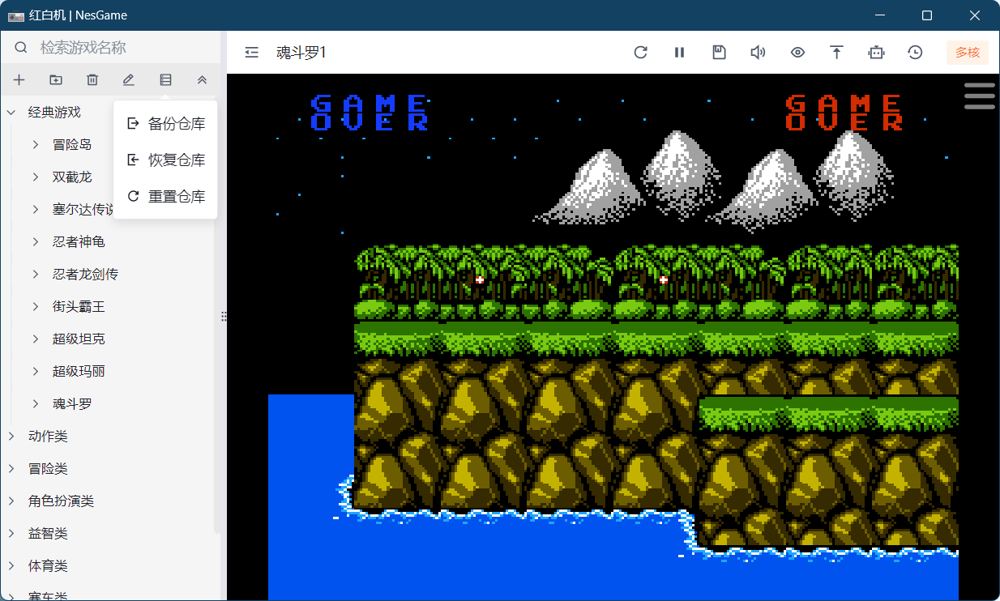
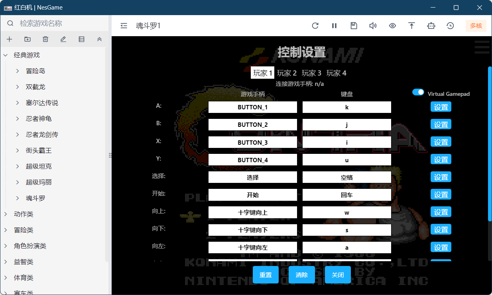
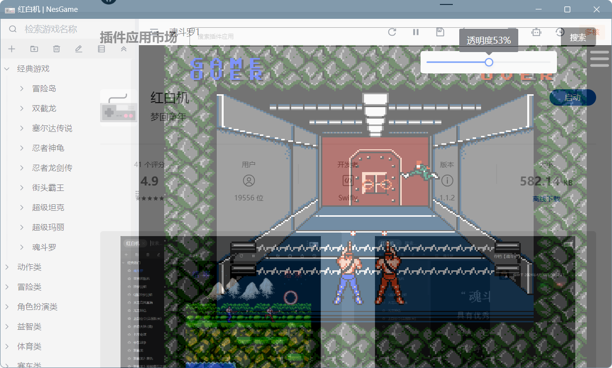
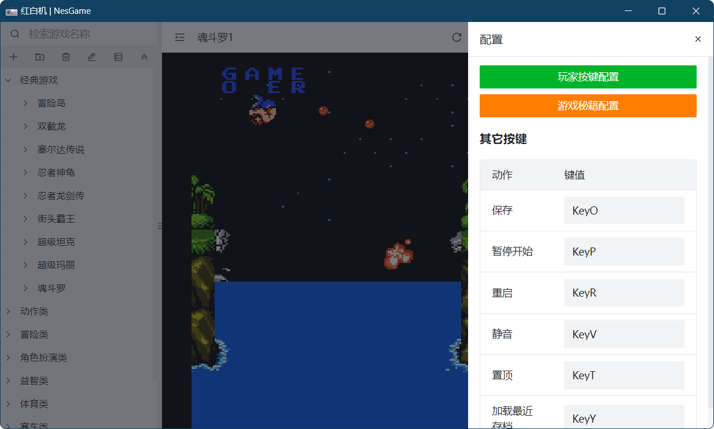
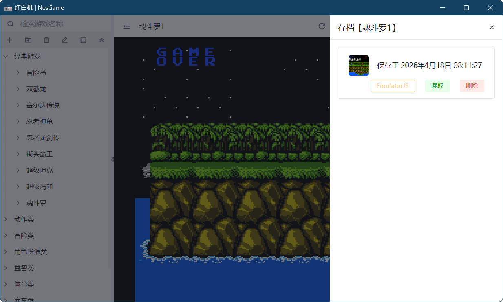
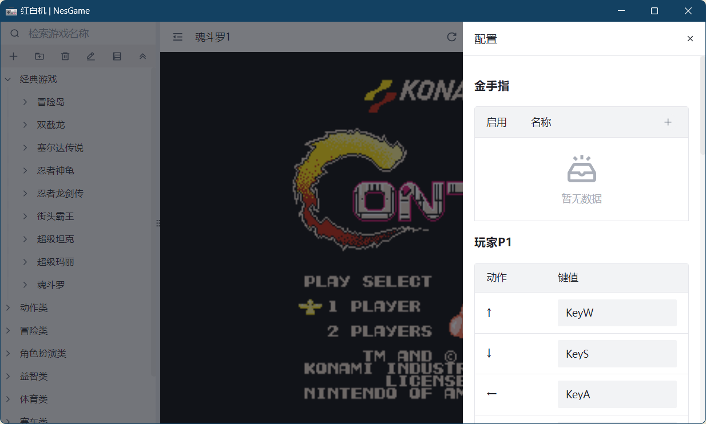

# 红白机 (FC/NES 模拟器)

基于 [uTools](https://www.u-tools.cn/plugins/detail/%E7%BA%A2%E7%99%BD%E6%9C%BA/) 的红白机（FC/NES）模拟器插件，支持在线游戏仓库、双模拟器核心、存档读档、金手指等功能。

## 功能特性

- 🎮 **双模拟器核心** — 支持 EmulatorJS 和 JsNes 两种核心，可自由切换
- ☁️ **远程游戏仓库** — 首次启动自动从远程仓库拉取游戏列表
- 💾 **存档/读档** — 支持游戏进度保存与恢复（含截图）
- 🔧 **金手指** — 支持添加和运行金手指代码
- 📁 **分类管理** — 支持自定义游戏分类、拖拽排序
- 🔀 **备份/恢复** — 支持导出/导入仓库数据（JSON 格式）
- 🔊 **音量控制** — 支持音量调节与静音快捷键
- 🪟 **窗口控制** — 支持透明度调节与置顶模式
- 🎨 **深色模式** — 自动跟随系统主题

## 界面预览

|  |  |
|:--:|:--:|
|  |  |
|  |  |
|  |  |

## 技术栈

| 技术 | 说明 |
|------|------|
| Vue 3 | 前端框架 |
| TypeScript | 类型安全 |
| Pinia | 状态管理 |
| Vite | 构建工具 |
| Arco Design Vue | UI 组件库 |
| EmulatorJS | 多格式模拟器核心 |
| JsNes | NES 专用模拟器核心 |

## 安装

### 方式一：通过 uTools 插件市场安装

在 uTools 中搜索「**红白机**」或「**hbj**」安装即可。

### 方式二：本地开发

```bash
# 克隆项目
git clone <repo-url>
cd NesGame

# 安装依赖
pnpm install

# 启动开发服务器
pnpm dev

# 构建
pnpm build
```

## 使用说明

### 启动

在 uTools 中输入 `红白机`、`hbj` 或 `game` 即可打开模拟器。

首次启动会自动从远程仓库拉取游戏数据并初始化。

### 操作按键

#### 玩家 1

| 按键 | 功能 |
|------|------|
| W | ↑ 上 |
| S | ↓ 下 |
| A | ← 左 |
| D | → 右 |
| K | A 键 |
| J | B 键 |
| I | C 键 |
| U | D 键 |
| Space | Select |
| Enter | Start |

#### 玩家 2

| 按键 | 功能 |
|------|------|
| ↑ | ↑ 上 |
| ↓ | ↓ 下 |
| ← | ← 左 |
| → | → 右 |
| Numpad2 | A 键 |
| Numpad1 | B 键 |
| Numpad5 | C 键 |
| Numpad4 | D 键 |

#### 全局快捷键

| 按键 | 功能 |
|------|------|
| Y | 加载最近存档 |
| O | 存档 |
| P | 暂停 |
| R | 重置 |
| V | 静音/取消静音 |
| T | 置顶/取消置顶 |

### 游戏管理

- **添加游戏**：右键侧边栏 → 添加游戏，支持网络地址或本地文件
- **添加分类**：右键侧边栏 → 添加分类
- **删除**：选中后右键删除
- **重命名**：选中后右键重命名
- **拖拽排序**：直接拖动调整顺序
- **备份数据**：导出当前仓库为 JSON 文件
- **恢复数据**：从 JSON 文件或网络地址导入仓库
- **重置仓库**：清除所有自定义数据，重新从远程仓库初始化

### 切换模拟器核心

在设置面板中可选择使用 **EmulatorJS** 或 **JsNes** 核心：
- **EmulatorJS**：支持更多格式（NES/SNES/GBA 等），功能更丰富，支持 Virtual Gamepad 和多玩家手柄配置
- **JsNes**：NES 专用核心，轻量快速

## 项目结构

```
src/
├── components/       # 组件（游戏画面、存档列表、设置面板、侧边栏）
├── data/             # 数据配置（游戏默认值、远程仓库地址）
├── hooks/            # 组合式函数（树操作、模拟器控制等）
├── store/            # Pinia 状态管理
│   ├── mainStore.ts   # 主状态（音量、透明度、就绪状态）
│   ├── treeStore.ts   # 树形数据（游戏分类与列表）
│   ├── gameStore.ts   # 游戏状态（当前游戏、存档、金手指）
│   └── controlerStore.ts # 控制器配置
├── utils/            # 工具函数
├── views/            # 页面视图
└── App.vue           # 根组件
```

## 远程仓库

游戏数据存储于远程 JSON 仓库，地址定义于 [games.ts](src/data/games.ts)：

```ts
export const GAME_REPO = "https://ghproxy.net/https://raw.githubusercontent.com/cyf783/nes-roms/master/_repo.json";
```

仓库地址：[https://github.com/cyf783/nes-roms](https://github.com/cyf783/nes-roms)

仓库数据格式为嵌套的树形结构：

```json
[
  {
    "title": "分类名称",
    "children": [
      {
        "title": "游戏名称",
        "path": "游戏ROM地址",
        "ext": "nes"
      }
    ]
  }
]
```

## License

MIT

## Author

[Swifly](https://github.com/)
